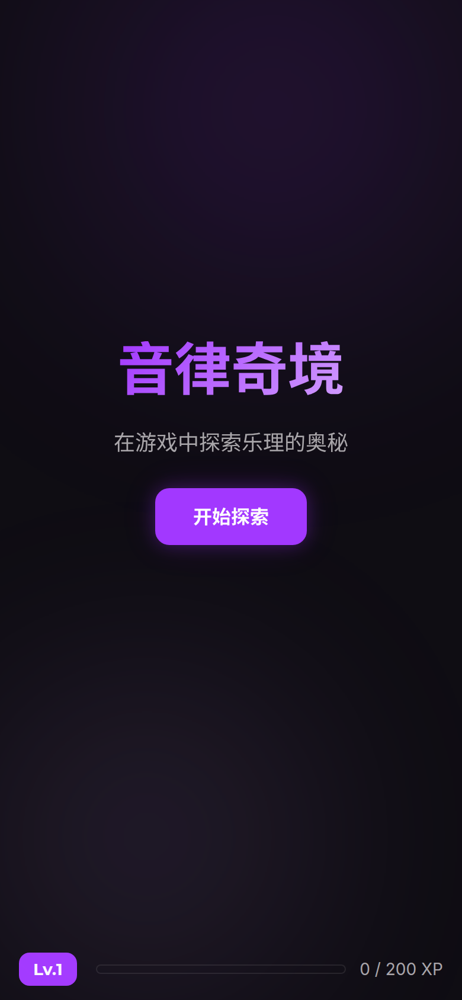
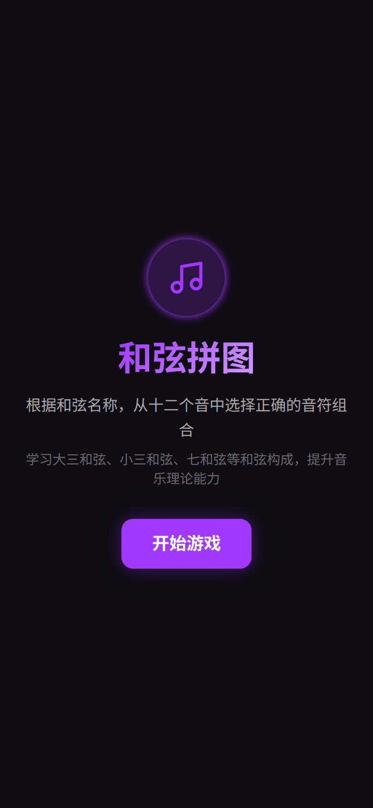
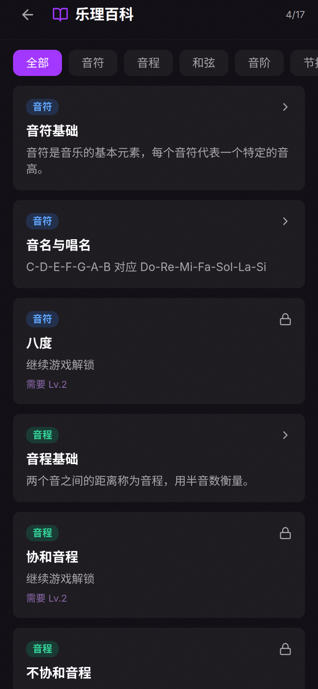
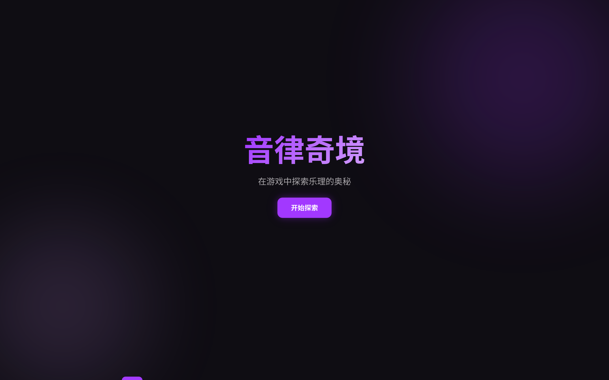

# 【实践案例】用 SOLO 从零打造「音律奇境」音乐理论学习游戏——一个人也能做出完整产品

## 标签

[SOLO三端实测]

## 正文

作为一个音乐爱好者+前端开发者，我一直想做一个音乐理论学习的互动游戏，但每次都被繁琐的工程搭建劝退。这次用 TRAE SOLO 的 Code 模式，从零开始完成了「音律奇境 MelodyQuest」——一个包含 4 个游戏模式 + 音乐百科的完整 Web 应用，整个开发过程让我对 SOLO 的能力有了非常直观的感受。

### 🎮 项目简介

音律奇境是一个音乐理论互动学习平台，包含以下核心功能：

1. **音符跑酷**：节奏下落式游戏，4 条音轨 + 触控按钮，训练音符反应速度
2. **和弦解谜**：听和弦、选音符，逐步解锁更复杂的和弦类型
3. **调式作曲**：在教会调式音阶上创作旋律，AI 评分判断终止式是否正确
4. **听音训练**：音程/和弦/音阶听辨，支持难度切换
5. **音乐百科**：17 个词条，按等级解锁，带实时音频演示

技术栈：React 18 + TypeScript + Vite + Tailwind CSS + Web Audio API + Zustand

### 🔧 实际开发步骤

#### Step 1：需求描述 → PRD 自动生成

我给 SOLO 描述了想要的功能和视觉风格（Electric Violet Nightclub 主题，参考 Deezer 的深色设计语言），SOLO 自动生成了完整的 PRD 文档和技术架构文档，包含设计 Token（颜色、字体、间距）、组件规划、数据模型等。

#### Step 2：项目初始化 + 核心模块搭建

一条指令完成项目脚手架搭建，SOLO 自动创建了 Vite + React + TypeScript 项目，配置好 Tailwind 和路由。随后并行构建了音频引擎（Web Audio API 封装）、音乐理论数据层、Zustand 状态管理、钢琴键盘组件等基础模块。

#### Step 3：6 个页面一次性生成

SOLO 用 sub-agent 并行模式，同时生成了首页、音符跑酷、和弦解谜、调式作曲、听音训练、音乐百科 6 个页面。每个页面都有完整的游戏逻辑和 UI 交互，不是空壳。

#### Step 4：移动端适配

我说了一句「适配手机端」，SOLO 就自动完成了所有页面的移动端适配：安全区域适配（刘海屏）、触控优化（touch-action、点击高亮消除）、响应式布局、触控按钮尺寸调整等。

#### Step 5：问题修复与迭代

- **音符跑酷没声音**：SOLO 定位到 AudioContext 在移动浏览器上默认 suspended 的问题，自动修复了 ensureContext 方法，加入 auto-resume 逻辑
- **键盘太多不适合手机**：SOLO 将 7 音轨 + 完整钢琴键盘重构为 4 音轨 + 4 个大触控按钮，更符合手机操作习惯
- **6 个 Bug 一次性排查**：SOLO 系统性审查了全部代码，发现并修复了 Home 页状态不响应、EarTraining 钢琴静音、StrictMode 双重游戏循环、ChordPuzzle 异常崩溃、ModeComposer 评分逻辑错误、EarTraining 定时器泄漏等问题

#### Step 6：桌面端效果

SOLO 生成的代码天然支持响应式，桌面端同样有不错的表现：

### 💡 SOLO 使用感受

**优点：**

1. **并行能力强大**：sub-agent 机制让多个页面可以同时生成，大幅提升效率
2. **上下文理解准确**：我说「键盘太多不适合手机」，它理解的是交互逻辑层面的重构，而不是简单缩放
3. **Bug 排查系统化**：不是头痛医头，而是通读全项目代码后给出完整的问题清单
4. **迭代友好**：每次修改都能保持代码风格一致，不会引入新的问题

**可以改进的地方：**

1. **Web Audio API 的移动端坑**：SOLO 初始生成的音频代码没有处理 AudioContext suspended 状态，这是移动浏览器的常见陷阱，希望未来能内置这些最佳实践
2. **React StrictMode 的双重渲染**：游戏循环类代码在 StrictMode 下容易出问题，SOLO 需要更主动地考虑这个场景
3. **移动端交互设计**：初始设计偏向桌面思维（7 个音轨 + 钢琴键盘），需要用户反馈后才优化为移动优先

### 📊 总结

用 SOLO 从零到完成这个音乐学习游戏，整个过程我只提了 6 次需求（初始需求、移动适配、修声音、改键盘、修 Bug、截图），SOLO 就完成了从 PRD 到代码到 Bug 修复的全流程。对于一个中等复杂度的前端项目，SOLO 的 Code 模式已经可以做到「描述即交付」，特别适合个人开发者快速验证产品想法。

音律奇境的完整代码已在本地运行，包含 Web Audio API 实时音频合成、Zustand 持久化状态、4 个完整的游戏模式和 17 个百科词条，是一个功能完备的 Web 应用。
